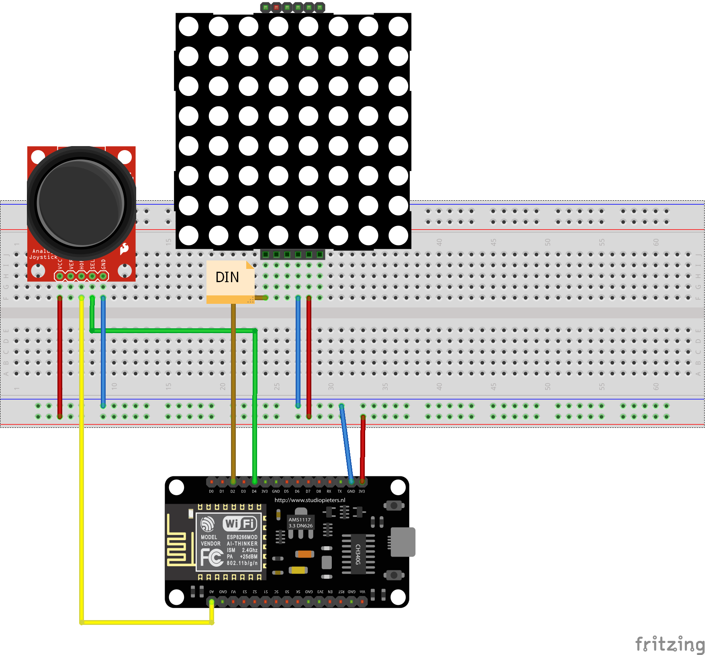
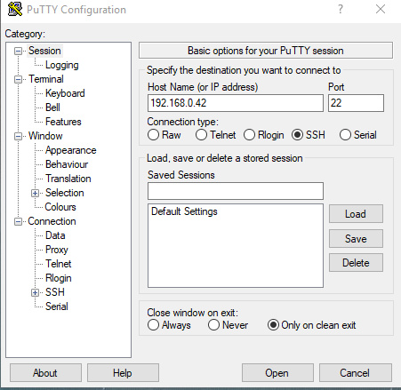
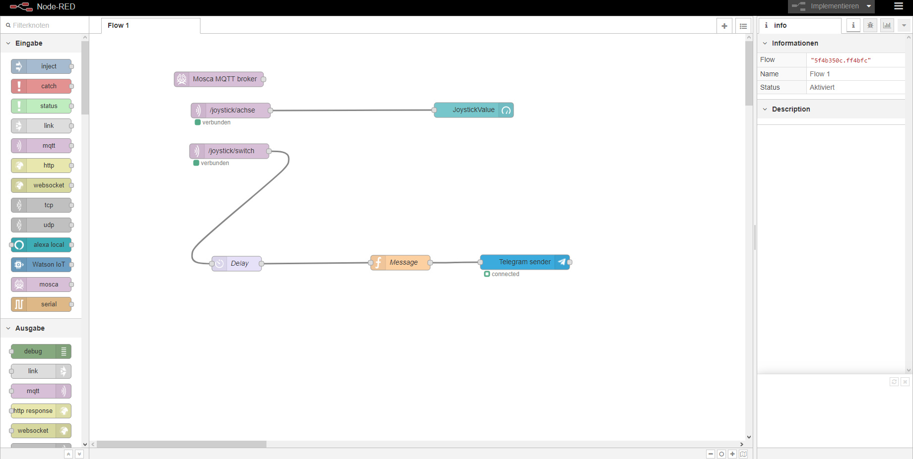
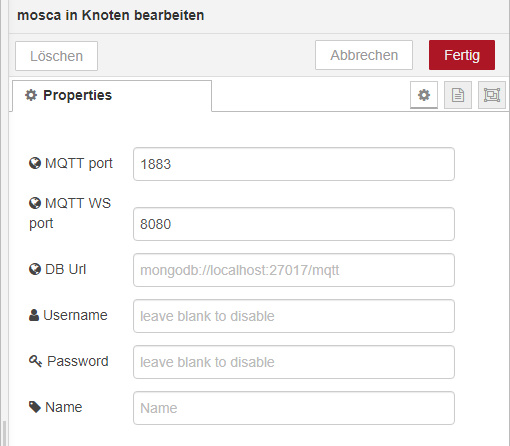
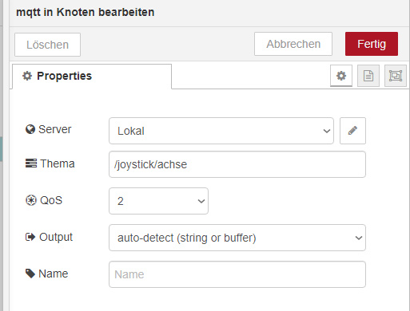
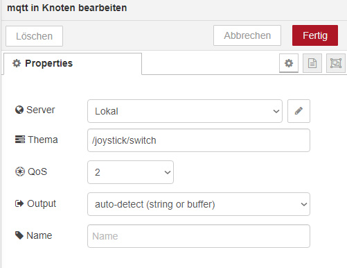
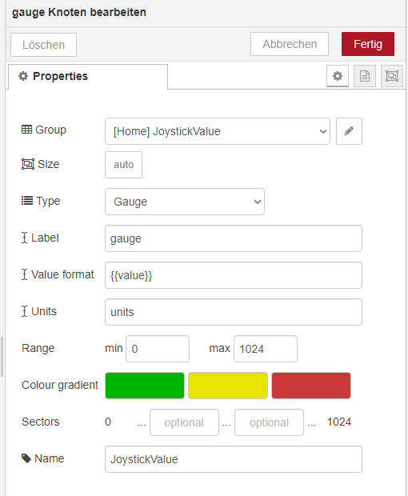
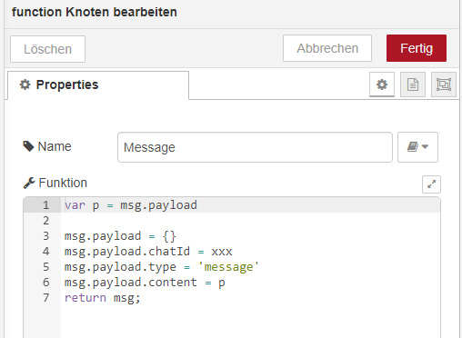
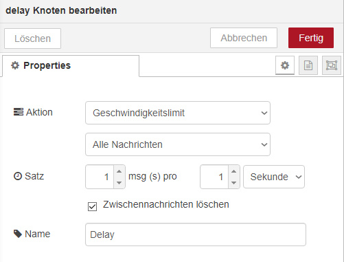
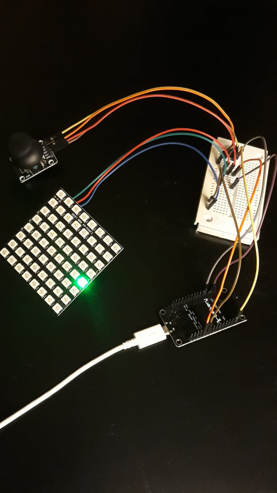

# IFI-Espressif8266 und Raspberry Pi 3

Im Rahmen der 2. Veranstaltungswoche des Moduls „Systemnahe Software“, ist ein Arduino Projekt erstellt worden. Dieses ist am Ende der Veranstaltung vollfunktionsfähig gewesen, doch es wurde in den darauffolgenden Wochen durch eine umfangreichere Version ersetzt. 
Die Blockveranstaltung gab den Anreiz, sich mit der Materie ausgiebiger zu Beschäftigen. Infolgedessen entstand in häuslicher Gruppenausarbeitung das nachfolgende Projekt. 

Das Projekt besteht im wesentlichen aus drei Aufgaben, die es zu lösen gilt.
1. Einrichten des MQTT Servers auf dem Raspberry Pi (RPi) mit Node-Red
2. Verbindungsaufbau zum Server mit dem Espressif8266
3. Einrichten eines Telegram-Bots

Hardware Komponenten für das Projekt:
* Raspberry Pi 3
* Espressif8266 Entwicklungsboard
* NeoPixel 8x8 LED Matrix
* Joystick mit Taster
* Diverse Jumper Kabel
* evtl. Steckbrett


In der obigen Abbildung ist der Schaltplan dargestellt. Neben den Versorgungsleitungen (rot für 3,3V und blau für GND) muss der des analogen Pins von der horizontalen Achse des Joysticks an Pin A0 des ESP8266 angeschlossen werden. Da es leider keinen weiteren analogen Eingang gibt, kann die Vertikalachse nicht mit eingebunden werden. Der digital Pin für den Taster des Joysticks ist an Pin D4 und die Datenleitung für die 8x8 RGB LED Matrix ist an Pin D2 des ESP8266 anzuschließen.

### 1. Einrichten des MQTT Servers auf dem RPi mit Node-Red
Auf dem RPi muss das Betriebssystem Raspbian mit Desktop laufen und eine Verbindung mit dem Internet und lokalen Netzwerk hergestellt haben. Um zu erfahren, wie man Raspbian installiert und einrichtet, verweise ich auf den Artikel: [https://www.heise.de/make/artikel/Raspberry-Pi-einrichten-3327906.html](https://www.heise.de/make/artikel/Raspberry-Pi-einrichten-3327906.html)

Nachdem der RPi nun läuft, empfiehlt es sich jetzt eine SSH Verbindung mit diesem aufzubauen, um ihn bequem am PC zu konfigurieren. Dies kann man über das Programm Putty ([Download Putty](https://www.putty.org)) realisieren.



Sobald nun eine Verbindung besteht, muss als erstes NodeJs und Node-Red installiert bzw. geupgraded werden. Dazu wird folgendes Kommando ins Terminal des RPi's eingetippt:

>update-nodejs-and-nodered

Nach einer Weile ist Node-Red nun installiert und damit Node-Red nach einem neuen Boot automatisch gestartet wird, empfiehlt sich das Kommando:

> sudo systemctl enable nodered.service

Und zu guter Letzt:

>sudo service nodered restart

### Node-Red starten und einrichten
Jetzt ist es Zeit, das erste Mal Node-Red zu starten. Dazu startet man den Browser und gibt die lokale IP-Adresse mit dem Port 1880 ein.



Als erstes müssen ein paar Sachen installiert werden. Dies geschieht über das Drop-Down Menü oben rechts in der Ecke  über den Reiter "Palette verwalten".
Es öffnet sich die Palette und man klickt nun auf den Reiter "Installieren".
Nun kann man nach Node-Red-Paketen suchen wie zum Beispiel:

>node-red-dashboard

Das Dashboard Paket erlaubt es, eine Benutzeroberfläche einfach und schnell zu erstellen, welche über den Browser aufrufbar ist.

Um mit MQTT loslegen zu können, fehlt noch ein MQTT-Broker. Dazu installiert man das Paket:

>node-red-contrib-mqtt-broker

Um die Einbindung mit Telegram zu realisieren, installiert man noch das Paket:

>node-red-contrib-telegrambot

Nun ist Node-Red einsatzbereit. Es gilt nun die MQTT-Einstellungen vorzunehmen.
Als erstes benötigen wir einen Mosca MQTT broker Baustein, den man links aus der Eingabe Funktionsleiste ziehen und auf der Arbeitsfläche ablegt.
Ein Doppelklick auf den Baustein öffnet die Einstellungen, die wie folgt vorzunehmen sind:



Jetzt werden noch zwei mqtt Eingabe-Bausteine benötigt. Die Einstellungen hierfür sind wie folgt vorzunehmen:




Nun nimmt man noch einen "gauge" Anzeige Baustein aus der dashboard Funktionsleiste und konfiguriert diesen.




Nach einem Klick auf Implementieren, ist Zeit für einen ersten Kommunikationstest. Das Dashboard kann über ipAdresse:port/ui im Browser aufgerufen werden. Auf den zweiten MQTT- Pfad wird später nocheinmal eingegangen.

### 2. Programmierung des Espressif8266
Der Espressif wird hier über die Visual Studio Code Entwicklungsumgebung programmiert. Eine kurze Anleitung gibt es hier:
[https://diyprojects.io/install-ide-platformio-extension-visual-studio-code-vscode-windows-32-bit-linux/#.XRnrzK9R2Uk](https://diyprojects.io/install-ide-platformio-extension-visual-studio-code-vscode-windows-32-bit-linux/#.XRnrzK9R2Uk)
```cpp
#include <Arduino.h>
#include <Adafruit_NeoPixel.h>
#include <ESP8266WiFi.h>
#include <ESP8266HTTPClient.h>
#include <PubSubClient.h>

#define PIXEL_PIN    D2  // Digital IO pin connected to the NeoPixels.
#define PIXEL_COUNT  64 // Number of pixels

#define ANALOG_PIN  A0  // Defines used analog Pin
#define BUTTON_PIN  D4  // Defines used Button Pin

// WiFi Settings
WiFiClient espClient;
PubSubClient client(espClient);

// Settings for NeoPixels
Adafruit_NeoPixel strip(PIXEL_COUNT, PIXEL_PIN, NEO_GRB + NEO_KHZ800);

// Prototypes
void setLine(uint8_t line , uint32_t color);
void reconnect();
void callback(char* topic, byte* payload, unsigned int length);

// Further definitions
uint32_t color = strip.Color(255,0,0);    //red color

// Used variables
int analogValue = 0;
int buttonState = 0;
char text[40];
```
Als erstes werden die verwendeten Bibliotheken mit dem #include Befehl eingebunden. Danach werden über Defines die benötigten Hardware Pins festgelegt. Danach folgen die Settings für Wifi und die Neopixel Matrix. Es werden insgesamt 3 Unterprogramme benötigt. Mit setLine kann eine horizontale Linie in der Matrix angezeigt werden. reconnect und callback werden für die WiFi Anbindung gebraucht. Da die LED Matrix in rot erscheinen soll, wurde die Farbe entsprechend konfiguriert. Des Weiteren werden hier noch zwei Variablen für den gemessenen Analog-Wert den Digital-Wert des Buttons initialisiert. Für Textausgabe dient das char-Array text.

```cpp
void setup() 
{

  pinMode(ANALOG_PIN, INPUT);         // Analoger Eingang an PIN A0
  pinMode(BUTTON_PIN,INPUT_PULLUP);   // Taster Eingang an PIN D4 mit PullUp

  Serial.begin(9600);                 // Baudrate 9600
  Serial.println("Hallo Welt");       // Begrüßungstext

  // NeoPixel Init
  strip.begin(); // Initialize NeoPixel strip object (REQUIRED)
  strip.show();  // Initialize all pixels to 'off'
  strip.setBrightness(50);

  // WiFi settings
  WiFi.mode(WIFI_STA);
  WiFi.hostname("Lokal");
  WiFi.begin("SSID", "password");

  // Warte auf Server Anbindung
  int index = 0;
  while (WiFi.status() != WL_CONNECTED) 
  {
    delay(500);
    Serial.print(".");

    // Zeigt grüne laufende LEDs an (Waiting for Connection)
    if(index >= 8)
    {
      index = 0;
    }
    strip.clear();
    //  Set pixel's color (in RAM)
    strip.setPixelColor(index+32, strip.Color(0,255,0));
    strip.show();

    index++;
  }

  Serial.println(WiFi.localIP());

  client.setServer("192.168.0.42", 1883);
  client.setCallback(callback);
}
```
Im Setup werden die Ein- und Ausgabe- Einstellungen sowie die Wifi- Settings vorgenommen. In einer while-Schleife wird versucht, sich mit dem WiFi zu verbinden. Dies wird mit einem grünen LED-Lauflicht auch auf der LED-Matrix dargestellt. Danach wird die lokale IP ins Terminal geschrieben und die Einstellungen für den Clienten sind vorzunehmen.

```cpp
void loop() 
{
  // Erneuter Verbindungsaufbau bei Connection-Verlust
  if (!client.connected())
   reconnect();

  client.loop();
  
  // Lese Analog-Wert vom Joystick
  analogValue = analogRead(ANALOG_PIN);

  // Level Anzeige auf NeoPixel Matrix
  if (analogValue >= 0 && analogValue <= 124)
  {
    setLine(0,color);
  }
  else if (analogValue >= 132 && analogValue <= 252)
  {
    setLine(1,color);
  }
  else if (analogValue >= 260 && analogValue <= 380)
  {
    setLine(2,color);
  }
  else if (analogValue >= 388 && analogValue <= 508)
  {
    setLine(3,color);
  }
  else if (analogValue >= 516 && analogValue <= 636)
  {
    setLine(4,color);
  }
  else if (analogValue >= 644 && analogValue <= 764)
  {
    setLine(5,color);
  }
  else if (analogValue >= 772 && analogValue <= 892)
  {
    setLine(6,color);
  }
  else if (analogValue >= 900 && analogValue <= 1024)
  {
    setLine(7,color);
  }

  // Taster-Abfrage
  buttonState = digitalRead(BUTTON_PIN);

  // Wenn taster gedrückt
  if (buttonState == 0)
  {
    sprintf(text, "Value of Joystick is %d", analogValue);
    client.publish("/joystick/switch", text);
  
  }

  // Übertrage Joystick Daten
  sprintf(text, "%d", analogValue);
  client.publish("/joystick/achse", text);

  // Wait for it
  delay(20);
}
```
Im Loop wird erst überprüft, ob der client immer noch verbunden ist. Ist dies nicht der Fall, so wird die Verbindung neu hergestellt. Jetzt wird der analoge Wert der Joystick-Achse eingelesen. Da die LED Matrix als Level-Anzeige dienen soll, wird über die nachfolgenden if-else Verzweigungen entschieden, ab welchem Wert welche Linie in der LED Matrix angezeigt werden soll. Es ist zwischen zwei Übergängen etwas Margin gelassen worden, um ein hin- und herspringen zwischen zwei Linien zu vermeiden. Danach wird der Button ausgelesen. Ist dieser gedrückt, so hat er den Wert 0 und erfüllt damit die if Bedingung. Nun wird der anzuzeigende Text mit dem analogen Wert in das char-Array "text" gepackt und kurzer Hand auch über MQTT published. Nach 20 ms Wartezeit fängt der Loop von vorn an.

```cpp
// Subroutine für NeoPixel um Linie anzuzeigen  
void setLine(uint8_t line , uint32_t color)
{
  strip.clear();

  for(int i=line*8; i<(line*8)+8; i++)
  {
    strip.setPixelColor(i, color);         //  Set pixel's color (in RAM)
  }
  strip.show();
}


void callback(char* topic, byte* payload, unsigned int length) {
  Serial.print("Message arrived [");
  Serial.print(topic);
  Serial.print("] ");
  for (unsigned int i = 0; i < length; i++) {
    Serial.print((char)payload[i]);
  }
  Serial.println();
}

void reconnect() {
  // Loop until we're reconnected
  while (!client.connected()) {
    Serial.print("Attempting MQTT connection...");

    if (client.connect("client-sfasdfasdf")) {
      Serial.println("connected");
      client.publish("/status/devices", "I'm here");
      //client.subscribe("/joystick");
    } else {
      Serial.print("failed, rc=");
      Serial.print(client.state());
      Serial.println(" try again in 5 seconds");

      // Warte 5 Sekunden und zeige grüne laufende LEDs an
      for(int i=0; i<8; i++)
      {
        strip.clear();
        //  Set pixel's color (in RAM)
        strip.setPixelColor(i+32, strip.Color(0,255,0));
        strip.show();

        delay(625);
      }
    }

    strip.clear();
  }
}
```
Hier sind die Unterprogramme aufgeführt. Die Routine setLine setzt über eine for-Schleife die entsprechenden Pixel der LED Matrix. Des Weiteren ist hier die callback und reconnect Routine definiert. In der reconnect Routine wird wieder das grüne LED Lauflicht auf der Matrix angezeigt, um zu signalisieren, dass ein Verbindungsaufbau durchegeführt wird.

### 3. Telegram-Bot einrichten
Zunächst muss die Telegram-App aus dem AppStore auf ein mobiles Endgerät installiert werden. Wenn ein Account erstellt wurde, kann [Telegram-Web](https://web.telegram.org/) über den Browser am PC aufgerufen werden.
Jetzt wird über die Suchleiste

>BotFather

zu den Kontakten hinzugefügt und im Chat aufgerufen.
Um einen neuen Bot zu erstellen, wird der Befehl

>/newbot

eingegeben. Der BotFather fordert nun auf, den Namen und Usernamen einzugeben. Der Username muss mit "bot" enden.
Danach rückt der BotFather endlich die API des Bots raus, die ersteinmal kopiert wird. Der Bot sollte jetzt auch als neuer Kontakt in der Leiste erschienen sein. Jetzt muss ein neuer Tab im Browser geöffnet und folgende Website aufgerufen werden:

>api.telegram.org/botAPI/getUpdates

Anstelle von API ist natürlich die API des Bots einzutragen. In der Website wird dann

>{"ok":true,"result":[]}

angezeigt. Nun müssen im Chatfenster des erstellten Bots ein paar Nachrichten versendet werden und danach die vorherige Website refreshed werden. Nun sollte die Website ungefähr so aussehen:

>{"ok":true,"result":[{"update_id":468963983,
"message":{"message_id":3,"from":{"id":xxx,"is_bot":false,"first_name":"yyy","language_code":"de"},
"chat":{"id":xxx,"first_name":"yyy","type":"private"},"date":1559487798,"text":"test"}}]}

Die "id" wichtig für die Einstellungen in Node-Red.

### Zurück zu Node-Red
Nun kann man in Node-Red den Funktionblock "Telegram sender" aus der Leiste ziehen und die nötigen Einstellungen konfigurieren. Es muss der Bot-Name, Token (API) und die Chat-ID eingetragen werden.
Damit ist Node-Red in der Lage, Telegram-Nachrichten über den Bot an ein mobiles Endgerät zu schicken.
Es muss nun noch ein function Block aus der Leiste gezogen und wie folgt konfiguriert werden:



Bisher existiert noch keine Entprellung des Tasters. Damit der Telegram-Chat nicht mit einer Fülle von Nachrichten pro Taster-Druck geflutet wird, kann mittels des Funktionsblocks "delay" der Durchsatz an Nachrichten reduziert werden. Dafür wurden folgende Einstellungen getätigt:



Nun sind alle Einstellungen getätigt und über einen Tastendruck wird per Telegram der Wert des Joysticks direkt aufs Handy gesendet. Darüber hinaus kann man live den Joystick-Wert auch im Dashboard ansehen.
So sieht der Aufbau umgesetzt aus:




